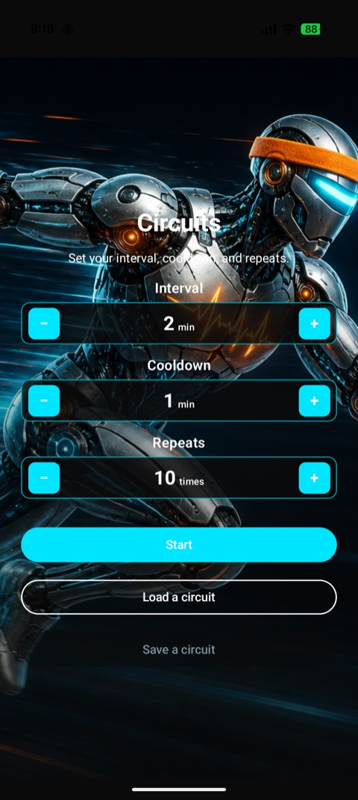
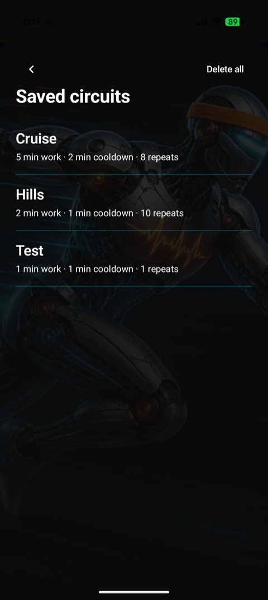

# Circuits

An Android interval training timer for structured workouts. Configure work intervals, cooldown periods, and repeat counts, then run through rounds with spoken cues and a persistent background timer.

## Screenshots

| Setup | Saved circuits | Timer running |
| --- | --- | --- |
|  |  |  |

## Features

- **Interval setup** — Set interval length, cooldown length, and number of repeats with stepper controls.
- **30-second pre-workout countdown** — A “Get ready” phase before the first work interval, with TTS and on-screen countdown.
- **Work / cooldown phases** — Automatic transitions between work and recovery; cooldown can be set to zero to skip straight to the next round.
- **Pause, resume, and stop** — Full control while a circuit is running.
- **Saved circuits** — Save, load, and delete named presets. Two sample circuits ship with the app:
  - **Hills** — 2 min work · 1 min cooldown · 10 repeats
  - **Cruise** — 5 min work · 2 min cooldown · 8 repeats
- **Text-to-speech** — Robotic voice announcements for pre-workout, work rounds, cooldown, and completion.
- **Background timer** — Foreground service keeps the timer running when the app is in the background, with a progress notification.

## Tech stack

| Layer | Technology |
| --- | --- |
| Language | Kotlin |
| UI | Jetpack Compose, Material 3 |
| Architecture | ViewModel + process-scoped timer engine |
| Persistence | Room 3 |
| Async | Kotlin Coroutines, StateFlow |
| Min SDK | 26 (Android 8.0) |
| Target SDK | 37 |

## Getting started

### Android Studio (recommended)

1. Open the project folder in Android Studio.
2. Sync Gradle when prompted.
3. Run on an emulator or device (**Run ▶**).

### Command line

Gradle needs a JDK. On macOS, the project is configured to use the JDK bundled with Android Studio.

Add to your shell profile (`~/.zshrc` or `~/.bashrc`):

```bash
export JAVA_HOME="/Applications/Android Studio.app/Contents/jbr/Contents/Home"
export PATH="$JAVA_HOME/bin:$PATH"
```

Then build and install:

```bash
./gradlew :app:installDebug
```

## Running tests

```bash
./gradlew :app:testDebugUnitTest
```

Unit tests cover timer phase transitions, pause/resume, config validation, and announcement flow.

## Project structure

```
app/src/main/java/net/aucutt/circuits/
├── MainActivity.kt              # Entry point
├── data/                        # Room entities, DAO, database, sample presets
├── service/
│   └── CircuitTimerService.kt   # Foreground service + notifications
├── timer/
│   ├── CircuitTimerEngine.kt    # Process-scoped countdown state machine
│   └── TimerAnnouncement.kt     # TTS announcement types
├── tts/
│   └── TtsSpeaker.kt            # Text-to-speech wrapper
└── ui/
    ├── theme/                   # Material 3 theme (icon-inspired palette)
    └── timer/
        ├── CircuitTimerScreen.kt
        ├── CircuitTimerViewModel.kt
        └── TimerModels.kt
```

## Timer flow

```
Idle → Pre-workout (30s) → Work → Cooldown → Work → … → Finished
                              ↑__________________|
                         (skipped if cooldown is 0)
```

## License

No license file is included yet. Add one before distributing the app publicly.
